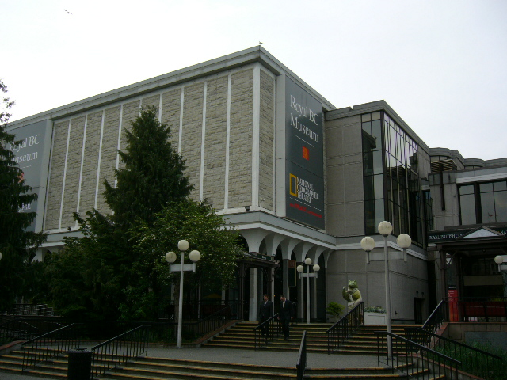
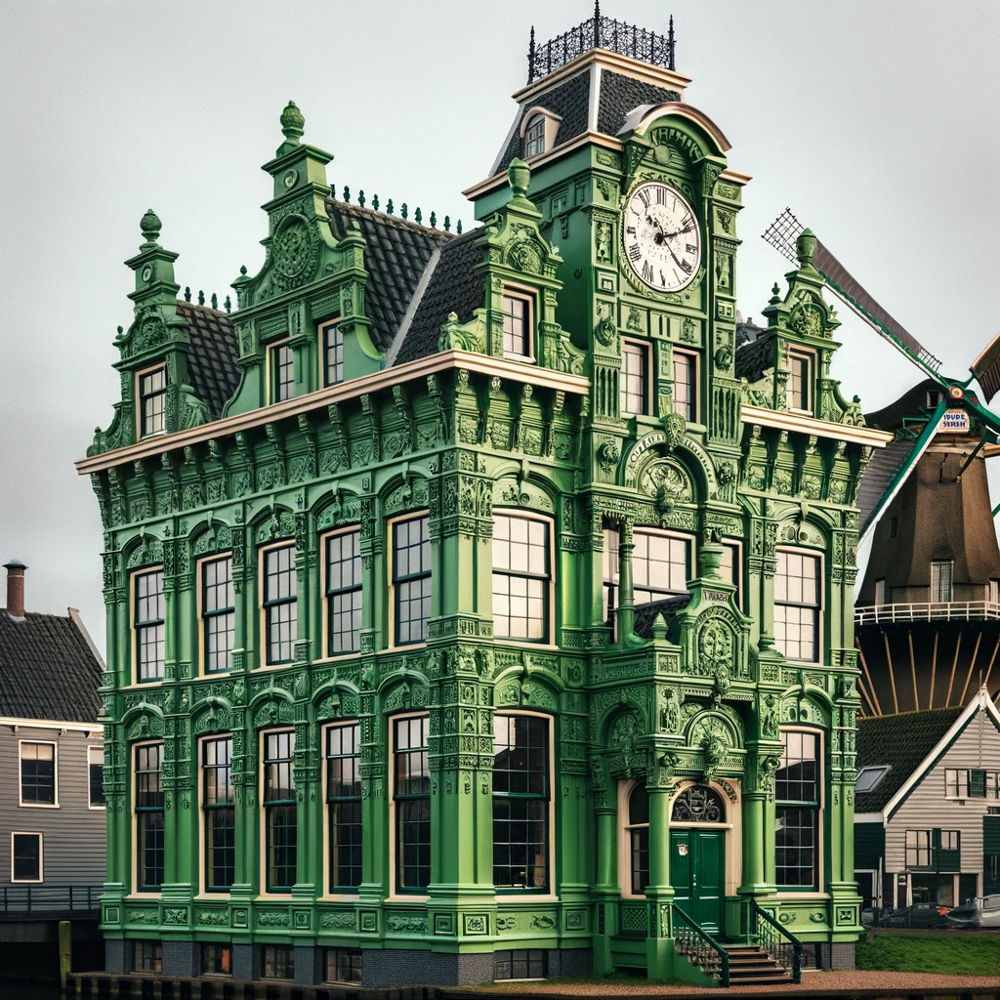
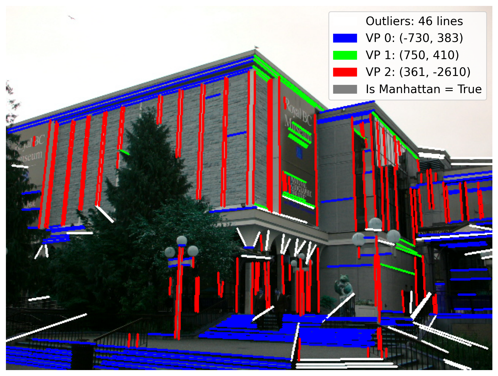
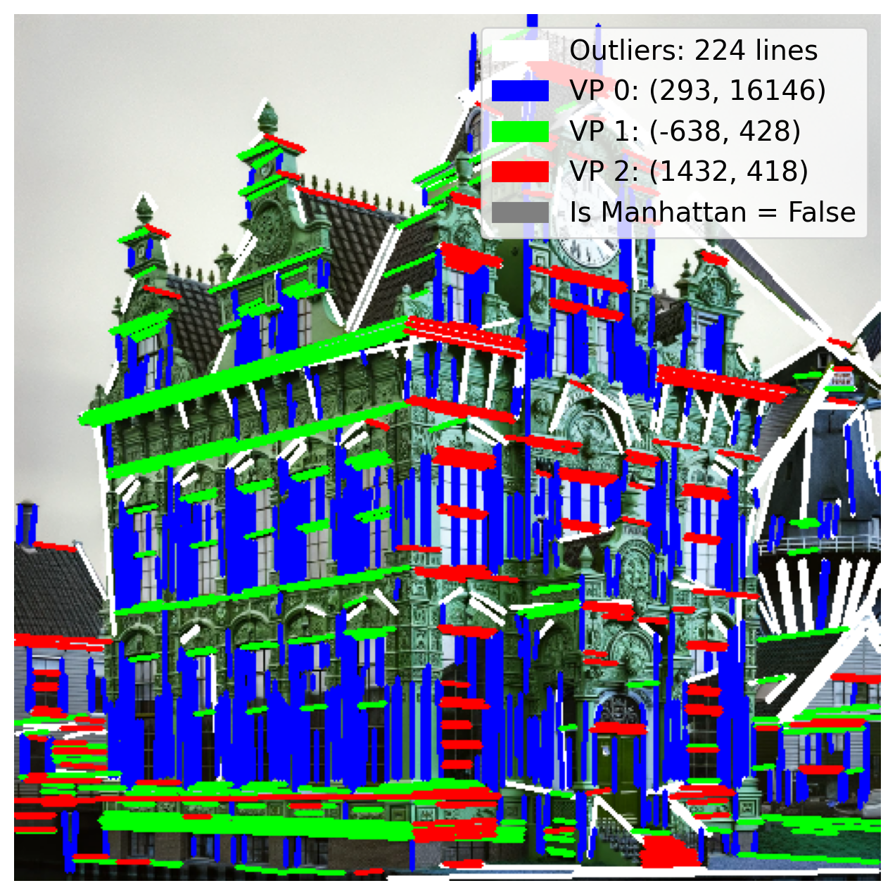

# CS413 Project: Estimating Manhattan frames to analyze structural inconsistencies

We use vanishing points and camera intrinsics to extract the dominant manhattan frame in an image to test the orthogonality constraints expected from real-world architectures. This method obtained an F1-Score of 0.75 on a mixed real/generated images handmade benchmark. This method showed signs of robustness to resampling, a common weakness of classical learning-based detectors, although more work is needed to explore it.
## 🛠 Installation

```bash
git clone --recurse-submodules git@github.com:Tetchki/cs413-project.git
cd cs413-project
```

1. Create a Python 3.12 virtual environment.

2. Install dependencies:

   ```bash
   pip install -r requirements.txt
   ```

3. Download DeepLSD model weights:

   ```bash
   python3 download_deeplsd_weights.py
   ```
### 🧱 Manual Setup for DeepLSD Weights (Optional)

If you prefer to download the weights manually instead of using `python3 download_deeplsd_weights.py`, follow these steps:

1. **Ensure the DeepLSD submodule is initialized:**

   * Confirm that the folder `ext/DeepLSD` exists. If it doesn’t, run:

     ```bash
     git submodule update --init --recursive
     ```

2. **Create the weights folder:**

   * Inside the `ext/DeepLSD` directory, create a subfolder named `weights`.
   * The folder structure should look like this:

     ```
     ext/
       └── DeepLSD/
           └── weights/
           └── ...
     ```

3. **Download the required model files:**

   * [deeplsd\_wireframe.tar](https://cvg-data.inf.ethz.ch/DeepLSD/deeplsd_wireframe.tar)
   * [deeplsd\_md.tar](https://cvg-data.inf.ethz.ch/DeepLSD/deeplsd_md.tar)

4. **Move the downloaded files into the `weights/` folder:**

   * Place both `.tar` files into `ext/DeepLSD/weights/`.
## 📁 Data

* The `data/` directory contains the datasets used for finetuning and evaluation.
* You can download the full data folder from [here](https://drive.google.com/drive/folders/1KE5jK0FZSqztiJwzxzEN0hkqLp3hMu_C?usp=sharing).
* The `data/synthbuster/keep` folder contains the 100 hand-picked building examples from the Synthbuster dataset that fit our scene geometry assumptions. If you want you can download the full Synthbuster dataset from [here](https://zenodo.org/records/10066460). Put its content inside the `data/synthbuster/` folder.
* Use the `extract_dataset.ipynb` notebook to hand-pick building examples from the Synthbuster dataset that fit our scene geometry assumptions.

## 📷 Camera Calibration Experiments

* Use `intrinsics_experiments.ipynb` to compare the performance of GeoCalib and Perspective Field methods for camera intrinsics estimation.

## 🚀 Benchmark Pipeline

* `pipeline.ipynb` is the main notebook to run the full geometry-based detection pipeline and generate benchmark results.

## 🧪 Playground Demo

* `playground.ipynb` provides a minimal demo to test the system on one real and one generated image for quick validation.

## 📌 Notes

* This project assumes a focus on geometric priors like vanishing points, line segment distributions, and camera intrinsics to identify generated images.
* The DeepLSD and Geolib submodules are required for full functionality.

## 🎯 Method Demo: Real vs Generated

<table>
  <tr>
    <th>Real Image</th>
    <th>Generated Image</th>
  </tr>
  <tr>
    <td></td>
    <td></td>
  </tr>
  <tr>
    <th>Real Output (correct Manhattan Frame)</th>
    <th>Generated Output (incorrect Manhattan Frame)</th>
  </tr>
  <tr>
    <td></td>
    <td></td>
  </tr>
</table>